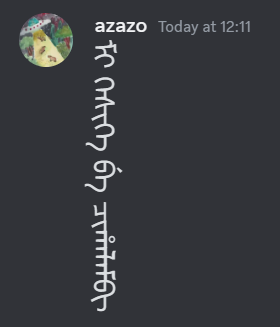

# ManchuRenderer-Vencord
Vencord plugin to render Manchu text vertically

Mostly for own use, don't expect much

TODO:
- [x] Fix the weird marks in options menu
- [x] Add change font option
- [x] Fix regex so not entire message is vertical (kinda)

# Function
If a message consists of only[^1] Manchu text, it will be rendered vertically (font and font size can be customised)

 Original                       | With ManchuRenderer
 :-----------------------------:|:-----------------------:
  | 

[^1]: `^(\p{Script=Mongolian}|\W)+$`

# Installation
[ere be sabureo](https://docs.vencord.dev/installing/custom-plugins/)